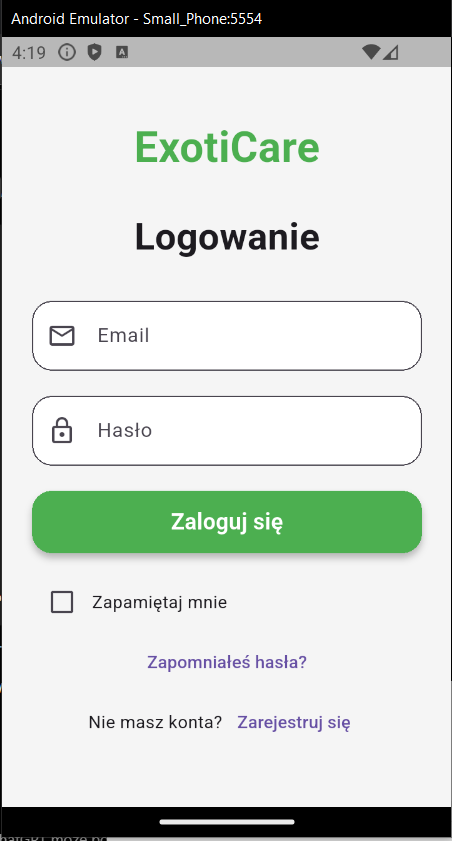
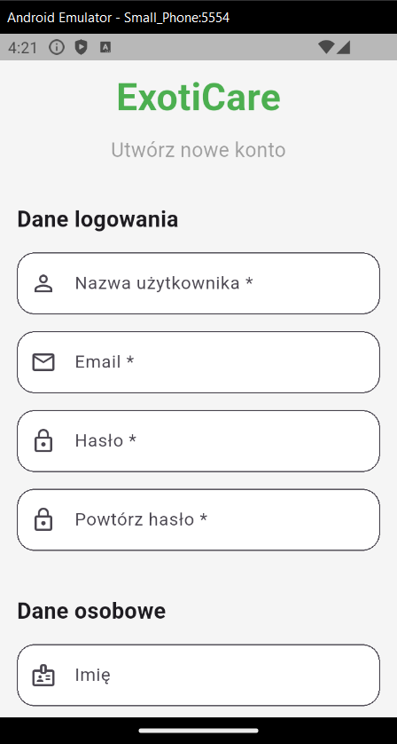
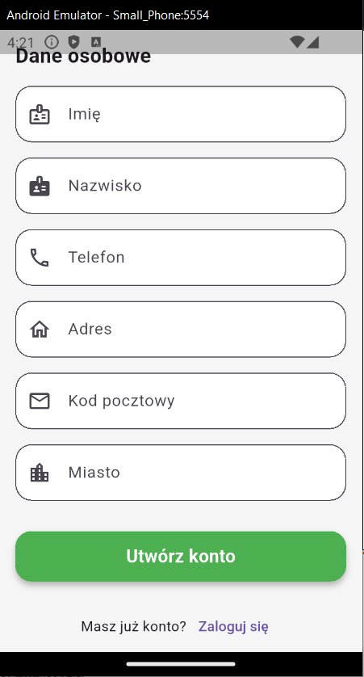
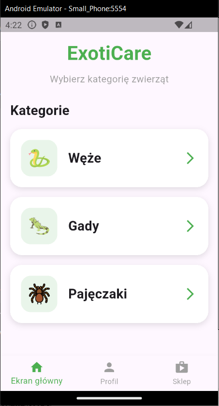
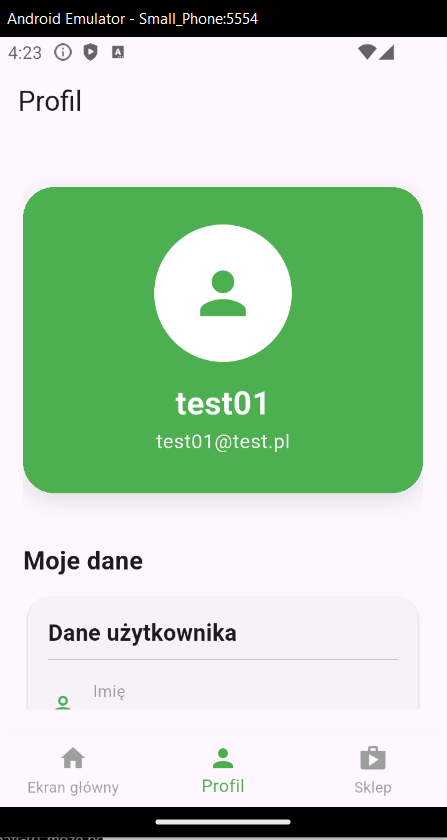
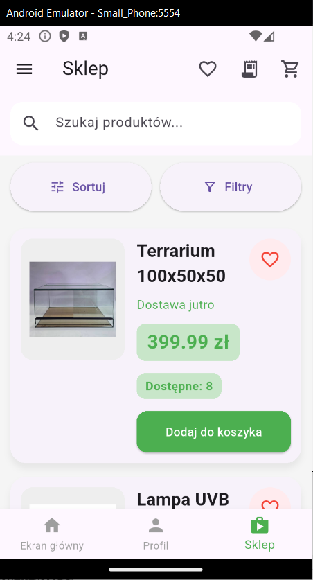
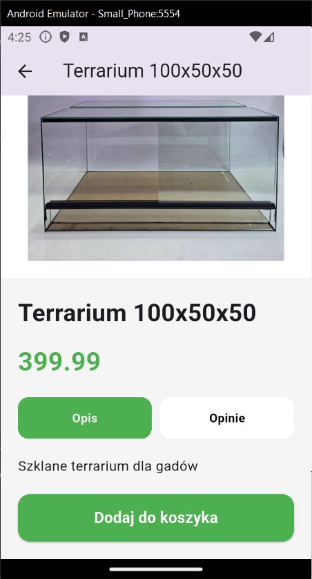
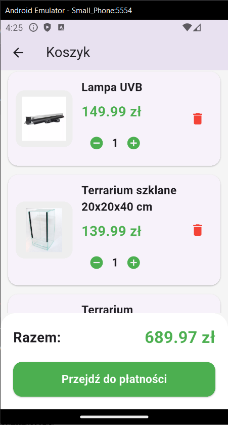

# ExotiCare

ExotiCare is a mobile application for managing exotic pets.
It also includes an integrated shop for purchasing accessories and supplies for exotic animal care. 
The project was developed as part of an engineering thesis.

## Screenshots

### Login



### Register




### Home Screen



### Profile



### Shop



### Product Details



### Cart



## Technologies

- Flutter
- Dart
- ASP.NET Core Web API
- Entity Framework Core
- SQL Server

## Features

- User registration and authentication
- Animal management
- Feeding schedule management
- Care reminders
- User profile
- Browse products in the shop
- Add products to favorites
- Shopping cart
- Product checkout

## Project structure

```
ExotiCare/
├── ExotiCareApi/
└── ExotiCareApp/
```

## Prerequisites

Before running the project, make sure you have installed:

- .NET SDK
- Flutter SDK
- Microsoft SQL Server
- SQL Server Management Studio (optional)
- Android Studio (or a physical Android device)

## Getting Started

### Backend

1. Open the `ExotiCareApi` project.
2. Configure the database connection in `appsettings.json`.
3. Restore NuGet packages.
4. Run the API.

```bash
cd ExotiCareApi
dotnet restore
dotnet run
```

### Mobile Application

1. Open the `ExotiCareApp` project.
2. Install Flutter packages.

```bash
flutter pub get
```

3. Start an Android emulator or connect a physical device.
4. Run the application.

```bash
flutter run
```

## Database

The project uses Microsoft SQL Server.

To create the database:

1. Open SQL Server Management Studio.
2. Execute the `Database/ExotiCare.sql` script.
3. Update the connection string in `appsettings.json`.

## License

This project is intended for educational purposes as part of an engineering thesis.

## Author

Mateusz (Matekriel)